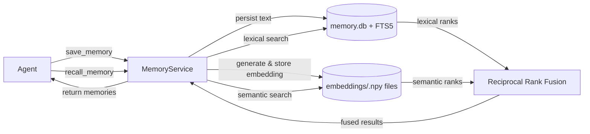

# Memory Graph

```mermaid
flowchart LR
  Agent[Agent] -->|save_memory| MemoryService[MemoryService]
  MemoryService -->|persist text| SQLite[(memory.db + FTS5)]
  MemoryService -->|generate & store embedding| Embeddings[(embeddings/.npy files)]
  Agent -->|recall_memory| MemoryService
  MemoryService -->|lexical search| SQLite
  MemoryService -->|semantic search| Embeddings
  SQLite -->|lexical ranks| RRF[Reciprocal Rank Fusion]
  Embeddings -->|semantic ranks| RRF
  RRF -->|fused results| MemoryService
  MemoryService -->|return memories| Agent
```