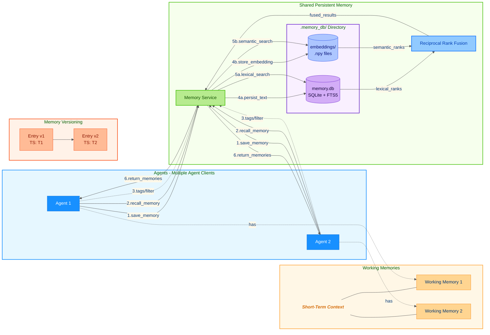

# Memory Graph

```mermaid
%%{init: {
  "theme": "base",
  "themeVariables": {
    "primaryColor": "#f0f7ff",
    "primaryTextColor": "#003673",
    "primaryBorderColor": "#0078D7",
    "secondaryColor": "#FFF8E8",
    "secondaryTextColor": "#7D4900",
    "secondaryBorderColor": "#FFA940",
    "tertiaryColor": "#F0FFF0",
    "tertiaryTextColor": "#005F00",
    "tertiaryBorderColor": "#00A000",
    "lineColor": "#555555"
  }
}}%%

flowchart LR
  %% Define main groups with styling
  subgraph Agents["Agents - Multiple Agent Clients"]
    direction TB
    style Agents fill:#e6f7ff,stroke:#1890ff,stroke-width:2px
    Agent1[Agent 1]:::agentStyle
    Agent2[Agent 2]:::agentStyle
  end

  subgraph WorkingMemories["Working Memories"]
    direction TB
    style WorkingMemories fill:#fff7e6,stroke:#ffa940,stroke-width:2px
    WorkingMemoriesLabel["Short-Term Context"]:::labelStyle
    WorkingMemory1[Working Memory 1]:::workingMemStyle
    WorkingMemory2[Working Memory 2]:::workingMemStyle
    WorkingMemoriesLabel --- WorkingMemory1
    WorkingMemoriesLabel --- WorkingMemory2
    style WorkingMemoriesLabel fill:none,stroke:none
  end

  subgraph SharedMemory["Shared Persistent Memory"]
    direction TB
    style SharedMemory fill:#f6ffed,stroke:#52c41a,stroke-width:2px
    
    MemoryService[Memory Service]:::serviceStyle
    
    subgraph FileSystem[".memory_db/ Directory"]
      style FileSystem fill:#f9f0ff,stroke:#722ed1,stroke-width:2px
      memoryDB[(memory.db<br>SQLite + FTS5)]:::dbStyle
      embeddingsDir[(embeddings/<br>.npy files)]:::embeddingStyle
    end
    
    RRF[Reciprocal Rank Fusion]:::fusionStyle
  end

  subgraph Evolution["Memory Versioning"]
    direction LR
    style Evolution fill:#fff2e8,stroke:#fa541c,stroke-width:2px
    oldMem["Entry v1<br>TS: T1"]:::versionStyle --> newMem["Entry v2<br>TS: T2"]:::versionStyle
  end

  %% Define connections for Agent 1
  Agent1 -.->|has| WorkingMemory1
  
  Agent1 -->|1.save_memory| MemoryService
  Agent1 -->|2.recall_memory| MemoryService
  Agent1 -.->|3.tags/filter| MemoryService
  MemoryService -->|6.return_memories| Agent1
  
  %% Define connections for Agent 2
  Agent2 -.->|has| WorkingMemory2
  
  Agent2 -->|1.save_memory| MemoryService
  Agent2 -->|2.recall_memory| MemoryService
  Agent2 -.->|3.tags/filter| MemoryService
  MemoryService -->|6.return_memories| Agent2

  %% Define MemoryService flows
  MemoryService -->|4a.persist_text| memoryDB
  MemoryService -->|4b.store_embedding| embeddingsDir
  MemoryService -->|5a.lexical_search| memoryDB
  MemoryService -->|5b.semantic_search| embeddingsDir
  
  %% Define RRF flows
  memoryDB -->|lexical_ranks| RRF
  embeddingsDir -->|semantic_ranks| RRF
  RRF -->|fused_results| MemoryService

  %% Define styles
  classDef agentStyle fill:#1890ff,stroke:#096dd9,color:white
  classDef workingMemStyle fill:#ffd591,stroke:#fa8c16,margin-top:10px
  classDef serviceStyle fill:#b7eb8f,stroke:#52c41a,stroke-width:2px,color:#135200
  classDef dbStyle fill:#d3adf7,stroke:#722ed1,color:#120338
  classDef embeddingStyle fill:#adc6ff,stroke:#2f54eb,color:#061178
  classDef fusionStyle fill:#91caff,stroke:#1677ff,stroke-width:2px,color:#003eb3
  classDef versionStyle fill:#ffbb96,stroke:#fa541c,color:#871400
  classDef labelStyle color:#d46b08,font-style:italic,font-weight:bold

```