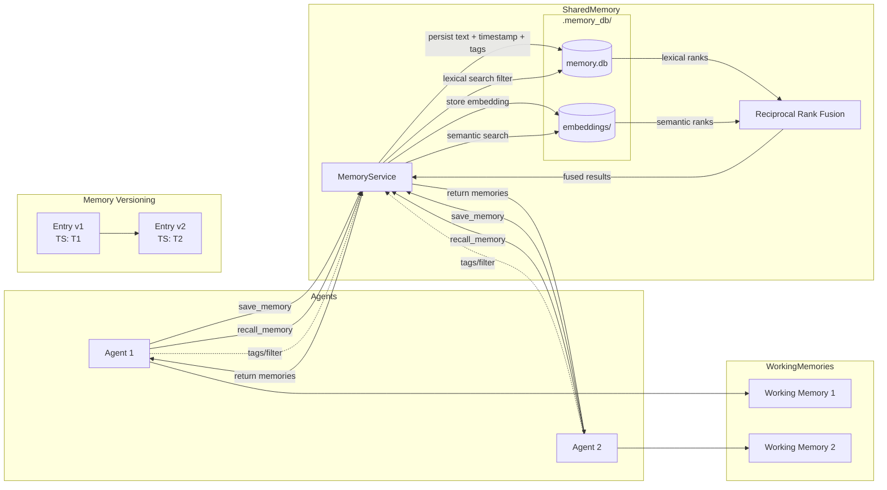

# Memory Graph

```mermaid
flowchart LR
  subgraph Agents
    direction TB
    Agent1[Agent 1]
    Agent2[Agent 2]
  end
  subgraph WorkingMemories
    direction LR
    Agent1 --> WorkingMemory1[Working Memory 1]
    Agent2 --> WorkingMemory2[Working Memory 2]
  end
  %% Metadata Flow for tags/filtering
  Agent1 -->|save_memory| MemoryService
  Agent2 -->|save_memory| MemoryService
  Agent1 -->|recall_memory| MemoryService
  Agent2 -->|recall_memory| MemoryService
  Agent1 -. tags/filter .-> MemoryService
  Agent2 -. tags/filter .-> MemoryService
  subgraph SharedMemory
    direction TB
    MemoryService[MemoryService]
    subgraph FileSystem[".memory_db/"]
      memoryDB[(memory.db)]
      embeddingsDir[(embeddings/)]
    end
    RRF[Reciprocal Rank Fusion]
  end
  MemoryService -->|persist text + timestamp + tags| memoryDB
  MemoryService -->|store embedding| embeddingsDir
  MemoryService -->|lexical search filter| memoryDB
  MemoryService -->|semantic search| embeddingsDir
  memoryDB -->|lexical ranks| RRF
  embeddingsDir -->|semantic ranks| RRF
  RRF -->|fused results| MemoryService
  MemoryService -->|return memories| Agent1
  MemoryService -->|return memories| Agent2
  %% Versioning timeline for memory entries
  subgraph Evolution["Memory Versioning"]
    direction LR
    oldMem["Entry v1\nTS: T1"] --> newMem["Entry v2\nTS: T2"]
  end
```