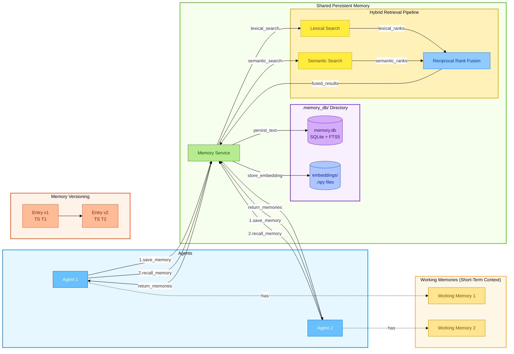

# Memory Graph

```mermaid
%%{init:{
  "theme":"base",
  "themeVariables":{
    "fontSize":"14px",
    "primaryColor":"#e6f7ff",
    "secondaryColor":"#fff7e6",
    "tertiaryColor":"#f6ffed",
    "edgeLabelBackground":"#ffffff"
  }
}}%%

graph LR
    subgraph AGENTS["Agents"]
        direction TB
        style AGENTS fill:#e6f7ff,stroke:#1890ff,stroke-width:2px
        A1["Agent 1"]:::agent
        A2["Agent 2"]:::agent
    end

    subgraph WM["Working Memories (Short‑Term Context)"]
        direction TB
        style WM fill:#fff7e6,stroke:#ffa940,stroke-width:2px
        WM1["Working Memory 1"]:::work
        WM2["Working Memory 2"]:::work
    end
    A1 -.->|has| WM1
    A2 -.->|has| WM2

    subgraph SHARED["Shared Persistent Memory"]
        direction TB
        style SHARED fill:#f6ffed,stroke:#52c41a,stroke-width:2px

        MS["Memory Service"]:::service
                
        subgraph STORE[".memory_db/ Directory"]
            direction TB
            style STORE fill:#f9f0ff,stroke:#722ed1,stroke-width:2px
            DB[(memory.db<br/>SQLite + FTS5)]:::db
            EMB[(embeddings/<br/>.npy files)]:::embed
        end

        subgraph RETRIEVE["Hybrid Retrieval Pipeline"]
            direction TB
            style RETRIEVE fill:#fff1b8,stroke:#d4b106,stroke-width:2px
            LEX["Lexical Search"]:::retr
            SEM["Semantic Search"]:::retr
            RRF["Reciprocal&nbsp;Rank&nbsp;Fusion"]:::fusion
            LEX -->|lexical_ranks| RRF
            SEM -->|semantic_ranks| RRF
        end
    end

    subgraph VER["Memory Versioning"]
        direction LR
        style VER fill:#fff2e8,stroke:#fa541c,stroke-width:2px
        V1["Entry v1<br/>TS T1"]:::vers --> V2["Entry v2<br/>TS T2"]:::vers
    end

    A1 -->|1.save_memory| MS
    A2 -->|1.save_memory| MS
    %% classLink A1,MS greenLink
    %% classLink A2,MS greenLink

    A1 -->|2.recall_memory| MS
    A2 -->|2.recall_memory| MS
    %% classLink A1,MS blueLink
    %% classLink A2,MS blueLink

    MS -->|persist_text| DB
    MS -->|store_embedding| EMB
    %% classLink MS,DB greenLink
    %% classLink MS,EMB greenLink

    MS -->|lexical_search| LEX
    MS -->|semantic_search| SEM
    %% classLink MS,LEX blueLink
    %% classLink MS,SEM blueLink
    RRF -->|fused_results| MS
    %% classLink RRF,MS blueLink

    MS -->|return_memories| A1
    MS -->|return_memories| A2
    %% classLink MS,A1 blueLink
    %% classLink MS,A2 blueLink

    classDef agent  fill:#69c0ff,stroke:#096dd9,color:#ffffff
    classDef work   fill:#ffe58f,stroke:#d48806,color:#874d00
    classDef service fill:#b7eb8f,stroke:#389e0d,color:#135200
    classDef db     fill:#d3adf7,stroke:#722ed1,color:#391085
    classDef embed  fill:#adc6ff,stroke:#2f54eb,color:#10239e
    classDef retr   fill:#ffec3d,stroke:#d4b106,color:#614700
    classDef fusion fill:#91caff,stroke:#1677ff,color:#003a8c
    classDef vers   fill:#ffbb96,stroke:#fa541c,color:#872400

    classDef greenLink stroke:#52c41a,stroke-width:2px
    classDef blueLink  stroke:#177ddc,stroke-width:2px
```